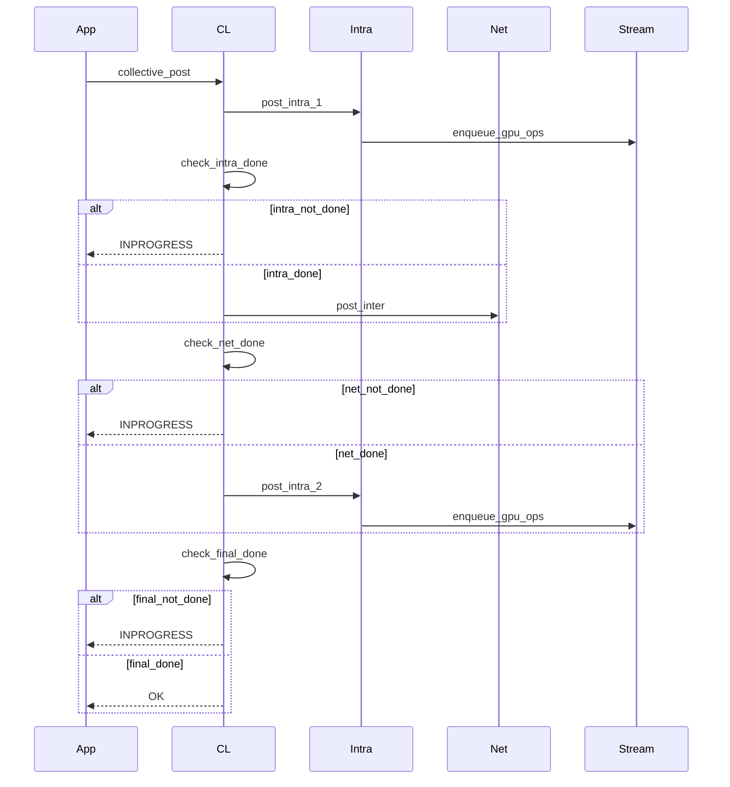

```mermaid
sequenceDiagram
participant App
participant CL
participant Intra
participant Net
participant Stream

App->>CL: collective_post
CL->>Intra: post_intra_1
Intra->>Stream: enqueue_gpu_ops
CL->>CL: check_intra_done
alt intra_not_done
  CL-->>App: INPROGRESS
else intra_done
  CL->>Net: post_inter
end

CL->>CL: check_net_done
alt net_not_done
  CL-->>App: INPROGRESS
else net_done
  CL->>Intra: post_intra_2
  Intra->>Stream: enqueue_gpu_ops
end

CL->>CL: check_final_done
alt final_not_done
  CL-->>App: INPROGRESS
else final_done
  CL-->>App: OK
end
```
