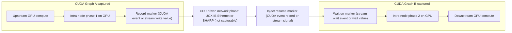

```mermaid
flowchart LR
    subgraph G1["CUDA Graph A captured"]
        C1["Upstream GPU compute"] --> I1["Intra node phase 1 on GPU"]
        I1 --> M1["Record marker (CUDA event or stream write value)"]
    end

    M1 --> CPU["CPU driven network phase: UCX IB Ethernet or SHARP (not capturable)"]

    CPU --> M2["Inject resume marker (CUDA event record or stream signal)"]

    subgraph G2["CUDA Graph B captured"]
        W["Wait on marker (stream wait event or wait value)"] --> I2["Intra node phase 2 on GPU"]
        I2 --> C2["Downstream GPU compute"]
    end

    M2 --> W

```
